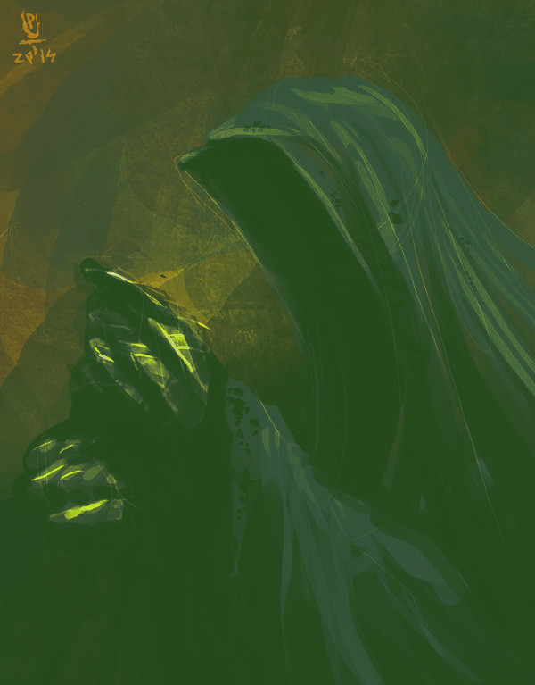
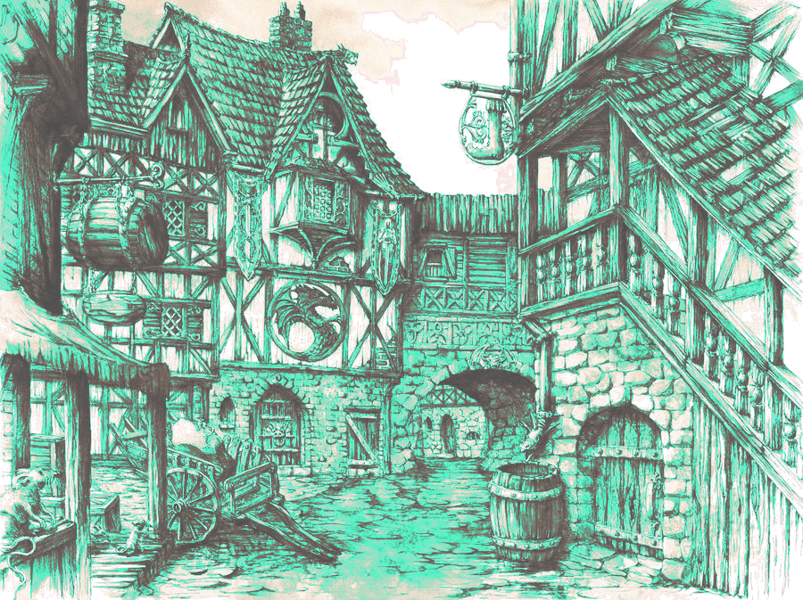

# G&C Historias tras unas cervezasVersión |VERSION| - Por [|AUTHOR|](|AUTHORURL|) - [Licencia CC BY 4.0](https://creativecommons.org/licenses/by/4.0/deed.es)## Introducción

En este suplemento tienes aventuras que podrás en tu abrevadero favorito tomando unas buenas cervezas. Están ordenadas de menor a mayor nivel, empezando por nivel 0.

## El gancho único I

Un kobold callejero, al que pagáis para que busque carros mal estacionados, llega corriendo con grandes noticias.

Ha encontrado un caballo rohirrim, un corcel élfico, un jabalí de guerra enano y varios perros de monta para medianos a las puertas de la «Taberna del poni pisoteador» y ninguno lleva pañal, contraviniendo la ordenanza municipal de cuidado de monturas. Eso puede ser mucha pasta en multas.

### Remolque de monturas

* **Monturas variadas (DA 4/250 mo):** Los caballos, el jabalí y los perros no paran de moverse así que no pueden poner más de 2 ganchos por turno.
* **Duro montaraz (2/1/1)** siempre mira fijamente durante dos turnos y luego actúa.
* **Ágil elfo (1/2/1)**
* **Rudo enano (3/1/0)**
* **Escurridizos medianos (0/1/0)** solo pueden pensar en recenar, beber, cantar y bailar. Cada turno tira d6, si sale par no actúan, están dentro de la taberna pidiendo comida y bebida.

\salto

Si consiguen llevarse las monturas, ese peculiar grupo de viajeros tendrá que ir andando hasta su destino, sea el que sea. 

Si revisan las alforjas y pasan la tirada de Magia, solo encontrarán un anillo de oro roñoso, alguna baratija familiar.

**Anillo roñoso:** Otorga un +2 Magia si alargas las eses de tus frases y usas mucho el posesivo.

## El gancho único II

Si deciden devolver el anillo roñoso, la extraña compañía se paga unas birras. También puede aprovechar a tomarse unas birras en la taberna. Diles que hay Hora Feliz, nadie puede resistirse a la Hora Feliz.

[puky7](https://www.deviantart.com/puky7/art/Nazgul-ride-486103756) - [CC BY-NC-SA 3.0](https://creativecommons.org/licenses/by-nc-sa/3.0/deed.es)

\salto

Uno de los espectros ha dejado su montura sin ticket de aparcamiento porque no tenía cambió. Por la matrícula es de Angmar, donde parece que no siguen las ordenanzas municipales de estacionamiento.

Sea como sea, si deciden quedarse a tomar algo, aparecerá un grupo de espectros con sus monturas espectrales qué parecen perseguir a la compañía.

### Montura sin ticket

* **Montura espectral (DA 5 / 150 mo)** Es medio mágico y para quitar o poner un gancho hay que hacerlo con Magia en vez de Maña y sacar dos éxitos
* **Espectro del anillo (5/3/5)** tiene d3 turnos de sorpresa, debe estar ocupado en cosas de espectros y no está atento a la grúa.

La cara que se le va a quedar al espectro cuando vuelvan y no tenga montura.

## El gancho único III

La compañía es buena gente y su camino largo. Sin que sirva de precedente podríais ayudarles.

El otro día alguien requisó unas águilas gigantes y están en el depósito municipal. Quizás puedan llevárselas por el morro, pero habrá que enfrentarse al troll del depósito.

### Con águilas gigantes es más fácil
* **Águilas gigantes (DA 5/200 mo)** 
* **Troll guardián del depósito municipal (6/2/0)** no puede cogérsele por sorpresa en el depósito.

Si consiguen sacar las águilas del depósito, la compañía se despide y alza el vuelo. Van a ahorrarse muchas horas de andar.

No cobrarán multas por este trabajo, pero al cabo de unos días una princesa elfa muy apañada tricotando les enviará unos jerséis élfico de lana. 

**Jersey élfico de lana.** Este jersey verde con motivos florales es perfecto para los fríos inviernos aunque pica un poco. Otorga +1 Maña y +1 Magia a su portadore.

\salto

## El gancho único IV

A la entrada de una de las tabernas de peor reputación de la ciudad hay un corcel élfico de pura raza. En la silla hay una nota que pone «Espera mi llegada con la primera luz del quinto día al alba, mira al este».

Al mirar al este veis que la puerta de la taberna se abre y entre el humo de la hierba de pipa de los medianos sale un viejo barbudo en bata de boatine que porta un báculo.

### El mago fumeta
* **Corcel élfico (DA 5/800 mo)** El viejo mago tiene montones de multas sin pagar atrasadas y con muchos recargos.
* **Viejo mago barbudo (3/5/6).** Solo sabe lanzar hechizos de luz con su báculo. En vez de lanzar hechizos y contrahechizos puede usar Magia para lanzar Luz y distraer a sus oponentes. Luz funciona como Hablar pero usando Magia. Debes sostener un bolígrafo o lápiz en tu mano y decir alguna tontería como «No puedes pasar». Si dejas de hacerlo, se rompe el hechizo.

Si consiguen llevarse su caballo mal estacionado, el viejo mago loco farfullará enfadado:
— Tendré que ir a pata y no voy a llegar a mi destino al amanecer del quinto día de coña. Les soltaré lo de que «Un mago nunca llega tarde, ni pronto: llega exactamente cuando se lo propone» y santas pascuas.

## La maldición del carruaje del vampiro

Little Barovia, el barrio baroviano de la ciudad, siempre está cubierto de una espesa niebla. Sus gentes son hurañas y desconfiadas y siempre hay violinistes tocando tristes tonadas, pero es un buen sitio para cazar carruajes góticos de cazavampires mal estacionados.

La cocina baroviana peca de usar mucho ajo y hay que pasar una tirada de Fortaleza para poder probar las delicias culinarias locales. Conseguirán de esta forma un horrible aliento a ajo.

\salto

El aliento de ajo permite una nueva acción contra vampires, **Echar el aliento**. Si echas tu aliento de ajo (tirada de Maña con éxito) a un vampire, este pierde 2 puntos en todos sus atributos hasta tu siguiente turno. Los negativos no se acumulan. Si hay varios alientos, solo alargan la duración.

[GrimDreamArt](https://www.deviantart.com/grimdreamart/art/Medieval-Town-729662707) - [CC BY-NC-ND 3.0](https://creativecommons.org/licenses/by-nc-nd/3.0/deed.es)Bien entrada la noche un carruaje negro se moverá por sus calles y se parará cerca del colegio mayor de chiques.

Si revisan el carruaje, los caballos zombies que tiran de él no llevan pañal. Lo curioso es que las animales de tiro zombies no cagan, pero siguen estando obligados a llevarlos. Es un agujero legal que siempre funciona con nigromantes y demás.

### Carruajes en la niebla

* **Carruaje negro (DA 6/350 mo)** 
* **Conde vampiro con extraño acento (6/5/6)** En vez de Hablar puede usar su Mirada Hipnótica y usar Magia en vez de fortaleza. Debes señalar con una de tus manos a tus objetivos. Si dejas de hacerlo, se rompe la hipnosis.
* **Conductore (2/3/1)**

Si consiguen llevarse el carruaje, amanecerá y el conde vampiro verá horrorizado que va a morir por no tener ningún sitio donde guarecerse de la luz solar.

\salto

Pueden negociar con él alguna compensación o dejarle morir por alergia a los rayos UVA. En ese caso, la niebla desaparecerá y la gente de Little Barovia saldrá a cantar y bailar para celebrar la muerte del vampiro.

## Más semillas de aventuras

### El aparcamiento

Desde el departamento de obras públicas no se les ha ocurrido otra idea que adaptar la Vieja mazmorra del hechicero loco en un aparcamiento subterráneo.

El problema es que nadie ha avisado a sus anteriores habitantes de la nueva ordenanza y siguen con sus costumbres de destripar y descuartizar a todes les que entran al ***parking municipal***. 

Les empleades de obras públicas encargades del acondicionamiento de la mazmorra han pintado unas rayas en el suelo y pista, así que las trampas también están activas.

### La noche de Saturnalia

La noche de Saturnalia todes les gruistes se lanzan a la caza de una presa de gran valor, el carro de Papa Noel. Pero no es una tarea fácil, es un gran mago, su carromato vuela gracias a sus tejones mágicos y todo el mundo le adora. Es el santo grial de las multas por mal aparcamiento y quien lo atrape tendrá asegurada la inmortalidad gruística y su hazaña será contada por los bardos durante eones.

### El gancho único V

El señoro del mal de algún sitio lejano ha sido derrotado por aquel grupito comandado por un mago fumeta, así que ha dejado lo del mal y ha montado un «food truck» de «smash burgers». A decir verdad, no ha dejado del todo lo del mal, porque cobra 30 monedas de oro por hamburguesa y les hecha piña. Además aparca donde quiere y como quiere.

Con su gran ojo llameante es imposible tenderle una trampa porque sabe si estás cerca antes de que puedas engancharlo y remolcarlo.